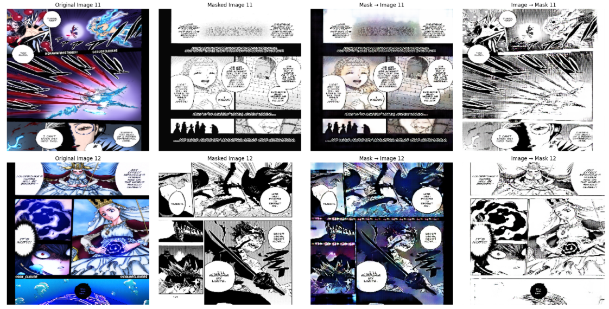

# Manga Colorizing

Manga Colorizing Using CycleGAN

---

## 📋 Table of Contents

| Section               | Description                                |
|------------------------|--------------------------------------------|
| [Introduction](#introduction)        | Overview and motivation behind the project |
| [Results](#results)                  | Main results with sample output image      |
| [Zero-Shot Results](#zero-shot-results) | Zero-shot inference with example output    |
| [Training Details](#training-details) | Dataset, hyperparameters, and setup info   |

---

## 🧠 Introduction

I love manga,so as i advanced in image field.
i wanted to use AI for Art and Entertainment.

---

## 📊 Results

Here’s a glimpse of the results from the trained model:

First Two images are Real from Dataset,while the other two one convert from gray to colored and the other convert from colored to gray

---

## 🚀 Zero-Shot Results

Testing the model on unseen data:
I scrapped a colored art for black clover from the internet.

---

## ⚙️ Training Details
Training took about 8 hours and done on kaggle.
